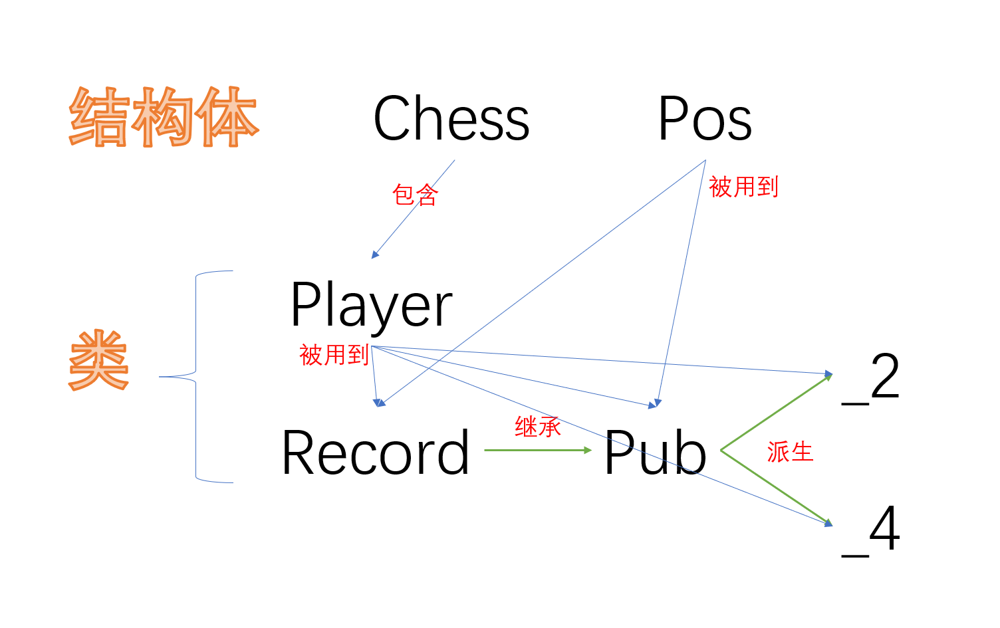

# 设计说明书
### 四国翻棋
### 沈默 2024040129
## 类设计
共有2个结构体和5个类

其中，```Record```是```Pub```的基类，```Pub```是```_2```和```_4```的基类

每当游戏开始时，进入```main```函数之后，由玩家决定调用。
分别有```_2```中的```MC()```函数和```_4```中的```MC()```函数以及```About()```/```Setting()```/```HISTORY()```等函数。
### Chess结构体
```cpp
struct Chess
{
	int level, cpg, cpx, cpy, cflag;//棋子大小，gxy坐标，被标记为
	bool live;//是否存活
	Chess(int le, int _g, int _x, int _y):level(le),cpg(_g),cpx(_x),cpy(_y),cflag(le == 10 ? 2 : 0),live(true){}//将第一排标记为叹号，军旗翻开
	Chess():level(0),cpg(0),cpx(0),cpy(0),cflag(0),live(0){}
};
```
### Pos结构体
```cpp
struct Pos
{
	int g, x, y;//区块，横坐标，纵坐标
	Pos(int _g, int _x, int _y):g(_g),x(_x),y(_y){}
};
```
### Player类
```cpp
class Player
{
public:
	bool live=true;				//初始存活
	int initarray[_CN] = {}, 
		deflevel[_CN] = { 10,20,20,20,21,21,32,32,32,33,33,33,34,34,34,35,35,36,36,37,37,38,38,39,40 };
								//旗雷炸兵排连营团旅师军司
	int defposx[_CN] = { 6,1,1,1,1,1,2,2,2,3,3,3,3,4,4,4,5,5,5,5,5,6,6,6,6 }, 
		defposy[_CN] = { 4,1,2,3,4,5,1,3,5,1,2,4,5,1,3,5,1,2,3,4,5,1,2,3,5 };		
								//初始位置
	int skiptimes = 0;			//跳过次数
	void Init(int ppos);		//初始化(ppos是玩家的编号)
	Chess MyChess[_CN] = {};	//棋子
	vector<string> DeadChess;	//死亡棋子
} P[5];							//全局最多有玩家1-4
```
### Record类(用于写入存档)
```cpp
class Record
{
	int cnt_step = 0;//记录步数
public:
	static 		vector<Pos> Go_Path;	//存储走棋路径
	static int 	Mix(Pos P);				//混合坐标
	static Pos 	UnMix(int mixed);		//解混合坐标
	void 		Record_Initialize();	//初始化记录存档
	static void Record_End(int who);	//记录结束(who为获胜方)
	//以下lsp为玩家编号，lsc为玩家旗子的编号，GXY代表要移动到的位置的坐标
	void 		Move(int lsp, 
					int lsc, 
					int G, 
					int X, 
					int Y);				//记录移动
	void 		Show(int lsp, int lsc);	//记录翻开
	void		Dead(int lsp, int lsc);	//记录棋子死亡
	static void RS(int sound);			//记录音效(sound为声音编号)
	int 		Step();					//记录步数，返回步数状态
	void 		Player_Dead(int who);	//记录玩家死亡(who为死去的玩家编号)
};
```
### Pub类(继承Record，包含_2,_4的公共函数)
```cpp
class Pub : public Record
{
public:
	static map< pair<int, int>, vector< pair<int, int> > > 
				 NA;							//非铁道普攻
	static vector<int> 
				 _2ROAD[8], 
				 _4ROAD[20];					//分别为双人/四人铁道
	static string 
				 _2LEVELMAP[41], 
				 _4LEVELMAP[41];				//双人/四人棋子名称
	static pair<int, int> 
				 XY[5];							//行营
	string 		 P_Name[5] = { "","玩家1","玩家2","玩家3","玩家4" };
												//玩家名称
	static void  PS(int sound);					//播放音效(sound为声音编号)
	static void  WIN(int who);					//胜利(who为获胜玩家)
	void 		 Draw_Arrow(					//画箭头
					int x1, 					//起始点横坐标
					int y1,						//起始点纵坐标
					int x2, 					//结束点横坐标
					int y2, 					//结束点纵坐标
					int L);						//箭头大小
	bool 		 IS_VOID(int g, int x, int y);	//判断是否为空(为空返回0)
	bool 		 IS_DEAD(int p);				//判断玩家是否死亡(死亡返回1)
	bool 		 NORMAL_GO(Chess A, Chess B);	//普通移动(能够到达返回1)
	int 		 N_KILL(Chess A, Chess B);		//判断大小，返回谁死亡
	void 		 Go_Super();					//超级模式初始化
	static void	 Game_Initialize();				//游戏初始化
	//纯虚基类
	virtual void PRINTNOW() = 0;
	virtual bool ROAD_GO_N(Pos F, Pos T) = 0;
	virtual bool ROAD_GO_B(Pos F, Pos T) = 0;
	virtual bool GOABLE(Chess A, Chess B, bool att) = 0;
	virtual void MC() = 0;
};
```
### _2类(双人模式)
```cpp
class _2 : Pub
{
	int  ChessX = 60, ChessY = 27;			//棋子的长宽
	int  _2startposx[3] = { 0,20,480 }, 
		_2startposy[3] = { 0,424,274 }, 
		_2divx = 115, 
		_2divy = 51;						//绘图相关棋盘参数
	int  trans[3] = { 0,1,-1 };				//转换坐标
	bool ROAD_GO_N(Pos F, Pos T);			//常规铁道移动(能够到达返回1)
	bool ROAD_GO_B(Pos F, Pos T);			//工兵铁道移动(能够到达返回1)
	bool GOABLE(							//判断是否可移动(能够到达返回1)
		Chess A, 
		Chess B, 
		bool att);							//(AB为两个棋子,att==1则为攻击)
public:
	void PRINTNOW();						//打印当前棋盘及附加图像
	void MC();								//主函数
} PLAY2, H2;//PLAY2用于游玩，H2用于双人模式的存档
```
### _4类(四人模式)
```cpp
class _4 : Pub
{
	//绘图相关棋盘参数
	int stpx[5] = { 0,442,651,610,400 }, 
		stpy[5] = { 0,472,430,220,262 }, 
		L = 27, D = 42, DD = 30;
	int ppx[5] = { 0,651,651,190,190 }, 
		ppy[5] = { 0,472,10,10,472 };
	COLORREF MyCol[5] = { RGB(100,100,100),
		RGB(216,108,0),RGB(145,63,165),
		RGB(112,156,0),RGB(39,104,160) };
	int transxx[5] = { 0,0,1,0,-1 }, 
		transxy[5] = { 0,1,0,-1,0 }, 
		transyx[5] = { 0,1,0,-1,0 }, 
		transyy[5] = { 0,0,-1,0,1 };		//转换坐标
	bool TEAM_WIN();						//判断队伍胜利(队伍胜利返回1)
	bool ROAD_GO_N(Pos F, Pos T);			//常规铁道移动(能够到达返回1)
	bool ROAD_GO_B(Pos F, Pos T);			//工兵铁道移动(能够到达返回1)
	bool GOABLE(							//判断是否可移动(能够到达返回1)
		Chess A, 
		Chess B, 
		bool att);							//(AB为两个棋子,att==1则为攻击)
public:
	void GO_NEXT();							//轮换下一步
	void PRINTNOW();						//打印当前棋盘及附加图像
	void MC();								//主函数
} PLAY4, H4;//PLAY4用于游玩，H4用于四人模式的存档
```
### 其他独立函数
```cpp
static void putnewbk(			//透明图片(抄来的)
	IMAGE* dstimg, 
	int x, 
	int y, 
	IMAGE* srcimg);				
static bool IS_MSG(				//判断鼠标点击是否在目标位置内(是则返回1)
	ExMessage msg, 
	int spx, 					//起始点横坐标
	int spy, 					//起始点纵坐标
	int lx, 					//宽度
	int ly);					//厚度
static void button(				//绘制带有文字和颜色的框
	int x, 						//起始点横坐标
	int y, 	 					//起始点纵坐标
	int w, 	 					//宽度
	int h, 						//厚度
	const char* text, 			//文字内容
	COLORREF col, 				//背景颜色
	int size = 20);				//文字大小
static void Start_Play();		//背景音乐播放函数
static void MyExec(string cmd);	//隐藏黑框执行命令行(cmd为命令)
void 		Setting();			//设置
void 		HISTORY();			//复盘函数
bool 		Update();			//更新函数
void 		About();			//关于函数
```
## 主要技术难点和实现方案/算法设计
### 技术难点
1.依赖项管理：该程序包括多个外部库，如graphics.h、easyx.h、mmsystem.h和dsound.h。管理这些依赖项并确保它们正确安装和链接可能具有挑战性。

2.图形和用户界面：该程序在很大程度上依赖于图形和用户接口元素，如按钮和图像。实现和管理这些图形组件可能很复杂，尤其是在处理不同的屏幕分辨率和纵横比时。

3.可靠的声音播放：要求同时异步播放最多两个的音乐或音效。

4.文件输入/输出和记录保存：该程序包括记录游戏动作并将其保存到文件的功能。实现文件I/O操作和管理记录保存过程可能很复杂，尤其是在处理不同的文件格式和错误处理时。

5.游戏逻辑和规则：该程序实现棋盘游戏的游戏逻辑和游戏规则。确保游戏规则的正确实施和处理各种游戏场景可能具有挑战性，尤其是在处理多个玩家和游戏片段之间的复杂交互时。

6.实现基于Github的自动更新
### 实现方案/算法设计
1.谨慎处理外部函数，查阅相关文档与示例

2.利用easyx库进行图像操作，实现图形用户界面；采用```CreateProcess```隐藏调用cmd命令时的黑框，改善画面效果

主要调用或实现的函数如下：
```cpp
initgraph(int w, int h)
loadimage(&img, img_path, w, h)
putimage(posx, posy, &img)
BeginBatchDraw();
EndBatchDraw();
cleardevice();

static void putnewbk(IMAGE* dstimg, int x, int y, IMAGE* srcimg) //新版png（透明图片）放置函数，抄来的
{
	HDC dstDC = GetImageHDC(dstimg);
	HDC srcDC = GetImageHDC(srcimg);
	int w = srcimg->getwidth();
	int h = srcimg->getheight();
	BLENDFUNCTION bf = { AC_SRC_OVER, 0, 255, AC_SRC_ALPHA };
	AlphaBlend(dstDC, x, y, w, h, srcDC, 0, 0, w, h, bf);
}
static void button(int x, int y, int w, int h, const char* text, COLORREF col, int size = 20)
{
	setlinecolor(WHITE);//设置框边颜色
	setbkmode(TRANSPARENT);//设置字体背景透明
	setfillcolor(col);//设置填充颜色
	fillroundrect(x, y, x + w, y + h, 10, 10);//画一个按钮框
	char text_[50] = { 0 };
	strcpy_s(text_, text);
	settextcolor(BLACK);
	LOGFONT f;
	gettextstyle(&f);
	f.lfHeight = size;
	_tcscpy_s(f.lfFaceName, "黑体");
	f.lfQuality = ANTIALIASED_QUALITY;//抗锯齿
	settextstyle(&f);
	int tx = x + (w - textwidth(text_)) / 2;
	int ty = y + (h - textheight(text_)) / 2;
	outtextxy(tx, ty, text_);
}
```

3.程序使用多线程处理播放背景音乐的后台任务：同时使用```PlaySound```和```mciSendString```函数播放音乐，并且通过多线程防止冲突
```cpp
//-------------------------------声明
HANDLE hThread;//线程句柄
DWORD pid;//线程ID
mutex mtx;//互斥锁
condition_variable cv;//条件变量
//-------------------------------函数
//-------------------------------背景音乐
void Start_Play()
{
	unique_lock<mutex> lck(mtx);//获得条件锁，释放互斥锁（在本程序中无用）
	mciSendString("open Resources/BGM.mp3 alias BGM type mpegvideo", 0, 0, 0);
	mciSendString("play BGM repeat", 0, 0, 0);
	cv.wait(lck);//等待条件锁信号
	mciSendString("close BGM", 0, 0, 0);
}
//-------------------------------音效
PlaySound("Resources/start.wav", NULL, SND_ASYNC);//异步播放
//-------------------------------调用
//-------------------------------1
if (PLAY_BGM) hThread = CreateThread(NULL, 0, (LPTHREAD_START_ROUTINE)Start_Play, NULL, 0, &pid);//播放背景音乐
//-------------------------------2
if (*op[i] == 1) hThread = CreateThread(NULL, 0, (LPTHREAD_START_ROUTINE)Start_Play, NULL, 0, &pid);//开启音乐
else cv.notify_one();//关闭音乐
```
4.不仅采用更加现代的```ifstream/ofstream```管理输入输出流，也采用```filesystem```头文件中定义的内容查找不定文件
```cpp
//读入
//其中一个例子
is.open("settings.config");//读取游戏设置
string key;
while (is >> key)
{
	if (key == "DO_REC") is >> DO_REC;
	if (key == "AutoUpdate") is >> AutoUpdate;
	if (key == "MAX_STEPS") is >> MAX_STEPS;
	if (key == "MAX_JUMPS") is >> MAX_JUMPS;
	if (key == "REST_STEPS") is >> REST_STEPS;
	if (key == "PLAY_BGM") is >> PLAY_BGM;
	if (key == "PLAY_SOUND") is >> PLAY_SOUND;
	if (key == "END") break;
}
is.clear();
is.close();
```
```cpp
string path = "Records";//存档文件夹
vector<string> Recs;
Recs.clear();
int N_R = 0, PAGE = 1, EP = 12;
//这个结构体能区分文件和目录
struct stat sb;
//循环直到文件夹中的所有项都结束
for (const auto& entry : filesystem::directory_iterator(path)) {
	//在下面的行中将路径转换为const char *
	filesystem::path outfilename = entry.path();
	string outfilename_str = outfilename.string();
	const char* path = outfilename_str.c_str();
	//检测路径是否指向非目录；如果是，则显示路径
	if (stat(path, &sb) == 0 && !(sb.st_mode & S_IFDIR)) Recs.push_back(outfilename_str), N_R++;
}
//此时Records文件夹中的文件已经保存在动态数组Recs中，随后可以以上面相同的方法进行读取
```
```cpp
//输出
void Record::Record_Initialize()
{
	if (!DO_REC) return;//不记录
	cnt_step = 0;
	string NAME = "Records/Rec-"+to_string(Tp)+"-", TS = "";
	time_t timep;
	time(&timep);
	char tmp[64];
	struct tm nowTime;
	localtime_s(&nowTime, &timep);
	strftime(tmp, sizeof(tmp), "%Y-%m-%d-%H-%M-%S", &nowTime);//获取格式化时间
	NAME += string(tmp);
	NAME += ".rec";
	os.open(NAME);//打开文件
	os << "REC " << Tp << " " << supermode << endl;
	for (int i = 1; i <= Tp; i++)
	{
		for (int j = 0; j < _CN; j++) os << P[i].MyChess[j].level << " ";
		os << endl;
	}
}
void Record::Record_End(int who)
{
	os << "win " << who << endl;
	os.close();
}
```
<!--采用这种方法（指```freopen_s```）方便对程序进行调试输出，增加编程效率-->

5.以循环查找为主要方式实现大部分游戏逻辑，另外使用宽度优先搜索实现工兵路径的查找
```cpp
bool _4::ROAD_GO_N(Pos F, Pos T)
{
	int f = Mix(F), t = Mix(T);//转换为数字以符合ROAD数组
	for (int r = 1; r <= 18; r++)
	{
		int pick = 0, pi = 0;
		for (int i = 0; i < _4ROAD[r].size(); i++)
		{
			if (_4ROAD[r][i] == f || _4ROAD[r][i] == t)
			{
				if (pick)
				{
					Go_Path.clear();//清空路径并记录新的路径
					if (_4ROAD[r][i] == t)
					{
						for (int ii = pi; ii <= i; ii++) Go_Path.push_back(UnMix(_4ROAD[r][ii]));
					}
					else
					{
						for (int ii = i; ii >= pi; ii--) Go_Path.push_back(UnMix(_4ROAD[r][ii]));
					}
					return true;
				}
				pick = 1;
				pi = i;
				continue;
			}
			if (pick && !IS_VOID(_4ROAD[r][i] / 100, (_4ROAD[r][i] / 10) % 10, _4ROAD[r][i] % 10)) break;//遇到非空位置表明此路不通
		}
	}
	return false;
}
bool _4::ROAD_GO_B(Pos F, Pos T)
{
	queue<int> q;
	bool vis[501];//标记数组
	int pre[501];//前驱指向数组
	while (!q.empty()) q.pop();
	memset(vis, 0, sizeof(vis));
	memset(pre, 0x3f, sizeof(pre));
	q.push(Mix(F));
	vis[Mix(F)] = 1;
	int mn = Mix(F), next = Mix(F);
	while (!q.empty())
	{
		mn = q.front();
		q.pop();
		if (mn == Mix(T))//找到了
		{
			Go_Path.clear();
			while (mn != 0x3f3f3f3f)
			{
				Go_Path.push_back(UnMix(mn));
				mn = pre[mn];
			}
			reverse(Go_Path.begin(), Go_Path.end());
			return true;
		}
		if (!IS_VOID(mn / 100, (mn / 10) % 10, mn % 10) && (mn != Mix(F))) continue;//此路不通
		for (int i = 1; i <= 18; i++)
		{
			for (uint64_t j = 0; j < _4ROAD[i].size(); j++)
			{
				if (mn == _4ROAD[i][j])//每条路上去找
				{
					if (j > 0 && vis[_4ROAD[i][j - 1]] == 0) vis[_4ROAD[i][j - 1]] = true, q.push(_4ROAD[i][j - 1]), pre[_4ROAD[i][j - 1]] = mn;
					if (j < _4ROAD[i].size() - 1 && vis[_4ROAD[i][j + 1]] == 0) vis[_4ROAD[i][j + 1]] = true, q.push(_4ROAD[i][j + 1]), pre[_4ROAD[i][j + 1]] = mn;
				}
			}
		}
	}
	return false;
}
```
6.向GitHub询问最新下载地址，提取版本号，与当前版本号进行比对，若不同则更新并返回false，若相同则为最新返回true
```cpp
bool Update()
{
	putimage(0, 0, &bk0);
	button(400, 300, 280, 120, "正在检查更新...", RGB(255, 255, 0), 35);
	MyExec("cmd.exe /c \"curl -s https://api.github.com/repos/PRXOR/FCMC/releases/latest | findstr \"browser_download_url\" > tmp.txt\"");
	is.open("tmp.txt");
	string tmp;
	is >> tmp;//前面的无用内容
	is >> tmp;
	uint64_t posd = tmp.find("download");
	string nv = tmp.substr(posd + 10, tmp.find("/", posd + 10) - posd - 10);//新版本号
	is.clear();
	is.close();
	remove("tmp.txt");
	if (nv == ver) return true;//已是最新版本
	MyExec("cmd.exe /c \"curl -L " + tmp + " -o FCMC.zip\"");//下载
	MyExec("powershell Expand-Archive -Path 'FCMC.zip' -DestinationPath '.' -Force");//解压
	remove("FCMC.zip");//删除压缩包
	return false;
}
```