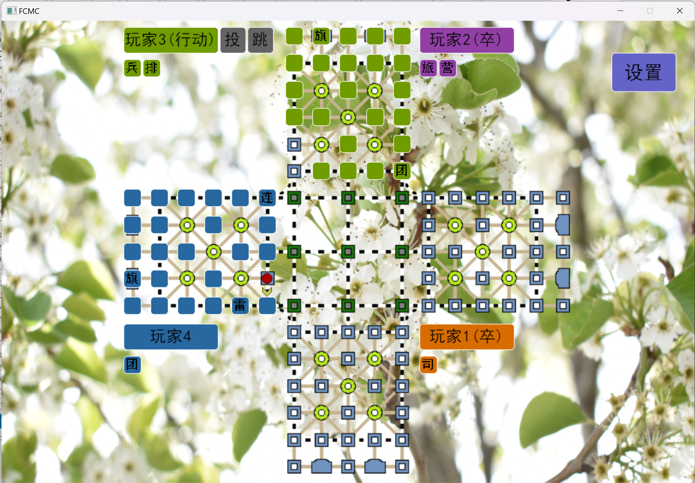

# 用户手册
### 四国翻棋
### 沈默 2024040129
## 0.欢迎界面以及主界面


在主界面中，可以通过鼠标单击选项，进入选项对应的模块。（本程序所有选择方式均为左键单击，后面不再赘述）

若设置了自动更新，将在欢迎页面前检查更新，若有可用更新将自动下载安装。
## 1.关于界面

关于界面展示了本程序总体的相关信息。

点击“检查更新”将会检查本程序是否有可用的更新：若有，将会自动下载并安装，用户可退出后执行新的翻棋程序；若无，将会在右边的正方形中显示背景为绿色的对勾。

点击蓝色的网址将会跳转到本项目的Github地址：<https://github.com/PRXOR/FCMC>

点击“确定”返回主界面。
## 2.设置界面

本程序目前共有7个自定义选项，其意义如图中所示。

点击开关按钮切换状态，点击```<``` ```>```使数字增加或减少。（其中，```警告步数```不得小于```最大步数-40```，并且三个数字均为正数）

点击“返回”回到上级界面。
## 3.双人对战界面
双人翻棋共有两种模式：全暗双人和随机双人。

全暗双人：初始时双方除军旗外所有棋子均为未知；随机双人：双方有同样个数的棋子被随机翻开，翻开个数亦为随机数

之后，两种模式遵循同样的规则：

从一号玩家开始，轮流行动。每次行动，玩家可选择翻开一个棋子，或操纵一个棋子攻击敌方棋子，或操纵一个棋子行动到某处，或跳过。攻击和被攻击的棋子均会显示大小。无子可动者或军棋被拔者判负

注意：军棋和被翻开的地雷，以及拔掉军旗的棋子无法行动；铁道上的棋子可沿所在铁轨任意移动，但不得越过其它棋子；不在铁道上的棋子每次只能沿线移动一格；工兵在铁道上可任意拐弯行动；每个玩家每局默认只有五次跳过机会（可在设置中更改）；行营内的棋子无法被攻击；不得攻击己方棋子；行棋总步数不应超过限制（接近时会有提醒），否则对局将被强制结束。

对局结束后，若在设置中启用了自动保存对局，则对局的复盘文件将被存放在```Record```文件夹中。

随后，将自动返回主界面。
## 4.四人对战界面
四人翻棋的规则与双人翻棋相似，两种模式的初始化方式亦相同。

但请注意以下不同点：
1.每个玩家与自己对面的玩家互为友军；
2.四名玩家以逆时针轮流行动；
3.已被判负者不再行动；
4.除了不得攻击己方棋子，也不可攻击友军棋子；
5.胜利是共有的，当某方两名玩家损失殆尽时另一方获胜。

## 5.复盘选择界面

复盘选择界面显示了```Record```文件夹内的复盘文件。

点击```上一页``` ```下一页```以翻页。

点击文件名选项进入复盘模式。


在复盘模式中，点击```下一步```以播放复盘，点击```正常``` ```全明```以切换观察模式。

亦可点击```设置``` ```返回```以进入设置或返回选择界面。

## 6.个性化手段
除了```设置```以外，用户可替换```Resources```文件夹中的```background0.png```和```BGM.mp3```为自己的资源文件，以获得更好的游玩效果。